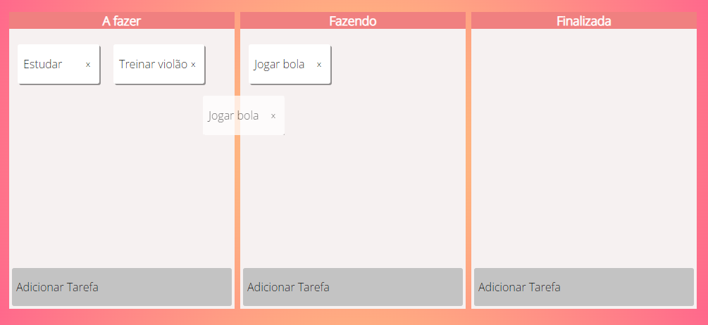

# Gerenciador de Tarefas

Uma aplicação para gerenciar tarefas do dia dia utilizadno HTML, CSS e JavaSript. 

  

## Funcionalidades

- Adicionar e remover uma tarefa
- Mudar o estado de uma tarefa ao arrastar

  

